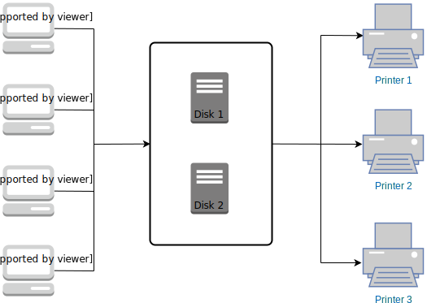

# MCSOS

MCSOS is a Java multithreading program that simulates multiple users to save and print files. Files can be stored on any disk and printed on any printer by any user.  

The diagram is shown below to illustrate the workflow:

## UserThread
Each user will read from a file named USERi where `i` is the index of this user.  Each USERi file will contain a series of the following three commands.  Anything between a `.save` and a `.end` is part of the data in file X. 

- .save X
- .end
- .print X

### Read/Write
- Only one user writing to a disk at a time. 
- Multiple threads can read at a time.

The UserThread will handle saving files to disk, and it will create a new PrintJobThread to handle each print request.

## PrintJobThread
Each printer will write data to a file named PRINTERi where `i` is the index of this printer.  A printer can only handle one line of text at a time. 

PrintJobThread handles printing an entire print request.  It gets a free printer (blocking if the are all busy) then read sectors from the disk and send to the printer - one at a time.

## Other Objects

### ResourceManager
ResourceManager is responsible for allocating a resource like a Disk or a Printer to a specific Thread.  

### DirectoryManager
The DirectoryManager is a table that knows where files are stored on disk.

### FileInfo
A FileInfo object will hold the disk number, length of the file, and the index of the starting sector

